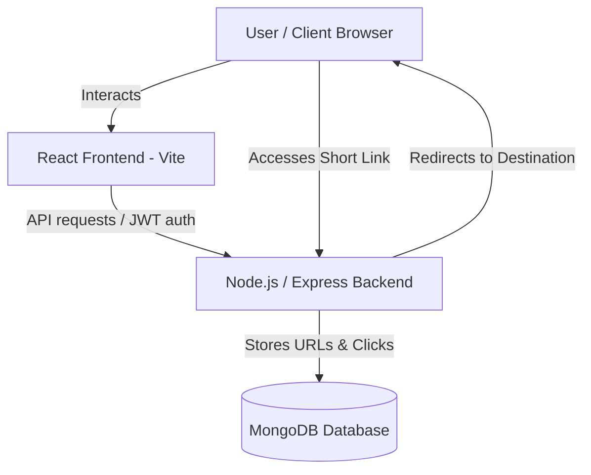

# Shortify - Premium URL Shortener & Analytics Dashboard

Shortify is a state-of-the-art URL shortener web application designed with a premium, gradient-free dark mode dashboard. It features strict user authentication, QR code generation, advanced analytics tracking, responsive collapsible drawer layouts, and custom link expiration times.

---

## 🚀 Deployment Links

* **Frontend App**: `[Insert Deployed Frontend URL Here]`
* **Backend API**: `[Insert Deployed Backend URL Here]`

---

## ✨ Features

1. **🔒 Secure Analytics & Ownership**:
   - Analytics are guarded; only logged-in users can look up performance stats.
   - Strict ownership validation verifies that users can only retrieve statistics for URLs they own.
2. **⚡ Tabbed Dashboard Layout**:
   - **Shorten Link**: Paste long URLs and quickly shorten them with support for custom expiration.
   - **Link Analytics**: Detailed lookup showing creation dates, destination targets, clicks, and live status.
   - **Quick Redirect**: Interactive redirect trigger utility.
3. **📅 Link Expiration Settings**:
   - Set preset expiration limits (**1 Hour**, **6 Hours**, **12 Hours**, **24 Hours**) or use a custom calendar datetime-local picker.
4. **📊 Interactive Sidebar**:
   - Toggleable and collapsible drawer layout (overlay drawer on mobile/tablet, sliding push layout on desktop).
   - Display stats showing total links created and **active (non-expired) links count**.
   - Interactive links list: click on any link in history to instantly view its performance stats.
5. **📱 Smart QR Code Generator**:
   - Generates scannable QR codes for created links inside the result cards and inspection panels.
6. **🔍 Shortcode URL Parser**:
   - Analytics lookup and redirect tools accept raw shortcodes (e.g., `7CIFhe`) or full URLs (e.g., `http://shortify/7CIFhe`), automatically extracting the shortcode.
7. **🎨 Modern Aesthetics**:
   - Clean, modern, high-contrast dark theme using Slate and Indigo/Blue styling (no gradients).
   - Fully optimized and responsive on smartphone, tablet, and computer viewports.

---

## 🛠️ Architecture: How It Works



1. **URL Creation**: An authenticated user submits a long URL (and optional expiration time). The backend generates a unique `shortCode` and saves the document in MongoDB, linking it to the user's `userId`.
2. **Redirection**: When visitors click a shortened link, the backend increases the `clicks` counter, checks if the link has expired (comparing `expiresAt` with the current time), and issues a `302 Redirect` to the original URL.
3. **Analytics Retrieval**: The frontend requests analytics details by sending the JWT token. The backend verifies the token and checks link ownership before returning click performance statistics.

---

## 📦 Installed Packages & Dependencies

### Backend Packages
* **`express`** (^5.2.1): Fast, minimalist web framework for routing.
* **`mongoose`** (^9.6.2): MongoDB object modeling tool designed to work in an asynchronous environment.
* **`jsonwebtoken`** (^9.0.3): Implements JSON Web Tokens for session authentication.
* **`bcryptjs`** (^3.0.3): Library for hashing passwords securely.
* **`cors`** (^2.8.6): Express middleware to enable Cross-Origin Resource Sharing.

### Frontend Packages
* **`react`** & **`react-dom`** (^19.2.6): Frontend component rendering.
* **`axios`** (^1.16.1): Promise-based HTTP client for browser API requests.
* **`tailwindcss`** & **`@tailwindcss/vite`** (^4.3.0): Utility-first CSS framework for visual layout styling.
* **`vite`** (^8.0.12): Highly optimized next-generation frontend build tooling.

---

## 💻 Local Setup & Execution

### 1. Backend Server Setup
1. Navigate to the backend folder:
   ```bash
   cd backend
   ```
2. Install dependencies:
   ```bash
   npm install
   ```
3. Configure environment variables (create a `.env` file):
   ```env
   PORT=5000
   MONGODB_URI=mongodb://localhost:27017/url-shortner-db
   JWT_SECRET=your_secure_random_string_here
   BASE_URL=http://localhost:5000
   ```
4. Start the backend server (Node.js 20.6.0+ supports native env files):
   ```bash
   node --env-file=.env server.js
   ```

### 2. Frontend App Setup
1. Navigate to the frontend folder:
   ```bash
   cd frontend
   ```
2. Install dependencies:
   ```bash
   npm install
   ```
3. Configure environment variables (create a `.env` file):
   ```env
   VITE_API_URL=http://localhost:5000
   VITE_SHORT_LINK_HOST=http://localhost:5000
   ```
4. Run the development server:
   ```bash
   npm run dev
   ```
5. Build the production bundle:
   ```bash
   npm run build
   ```
